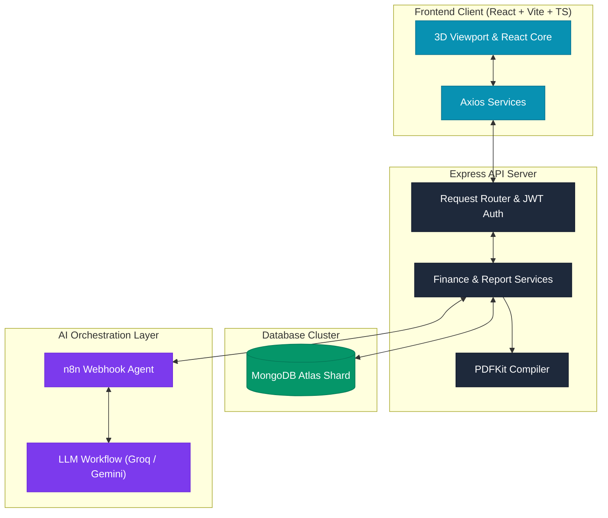

# 🌌 Future Finance AI

> **A Premium, Dark-Mode First Personal Wealth Ecosystem and n8n-Orchestrated Financial Agent.**
> Inspired by the clean, minimalist design systems of Apple, Stripe, and Linear.

---

## 🚀 Key Highlights

*   **Interactive 3D Hologram Core:** Powered by Three.js and React Three Fiber, featuring a slow-orbiting particles field and floating glass torus that reacts dynamically to mouse coordinates.
*   **n8n-Orchestrated Financial Advisor:** A glassmorphic chat interface connected to an advanced n8n workflow agent. Injects live MongoDB metrics (income, expenses, active goals) into LLMs (Groq, Gemini, OpenAI) to generate precise timelines and mutual fund recommendations.
*   **Financial Health Gauge:** Visual count-up radial gauge that grades user savings, debt ratios, and spending habits from `0` to `100` with letter grade feedback (A, B, C).
*   **Intelligent Goal Forecasts:** Mapped active progress rings calculating remaining contributions, target values, and months required to hit goals.
*   **50/30/20 Budget Analyzer:** Real-time allocation auditor verifying user expenditure categories against the standard 50% Needs, 30% Wants, and 20% Savings budget framework.
*   **Vector Monthly PDF Compiler:** Generates clean, download-ready PDF performance reports complete with account balances, category breakdowns, and AI advisory summaries using vector drawing with PDFKit.

---

## 📐 System Architecture

This diagram illustrates how the system coordinates client-side visualization, backend routing, database storage, and the n8n agent orchestration pipeline:



---

## 🛠️ Technology Stack

| Architecture Layer | Technologies Utilized |
| :--- | :--- |
| **Client-Side Framework** | React 19, Vite, TypeScript, Tailwind CSS |
| **Interactive Rendering** | Three.js, React Three Fiber (`@react-three/fiber`), `@react-three/drei`, Framer Motion |
| **Charts & Dataviz** | Recharts (Responsive containers, Area & Pie charts) |
| **Backend & Runtime** | Node.js, Express, JWT, CORS, Axios, Nodemon |
| **Document Generation** | PDFKit (Vector canvas drawing, custom layout positioning) |
| **Database & Schema** | MongoDB Atlas, Mongoose |
| **AI Orchestration** | **n8n** (Automated Workflow Engine, Agent Nodes, Webhooks) |
| **LLM Inference** | Groq (Llama-3), Gemini 1.5, OpenAI GPT Models |

---

## 🤖 Advanced AI Agent Orchestration via n8n

Future Finance AI leverages **n8n** as an enterprise-grade AI agent orchestration layer. Rather than executing simple, isolated LLM text prompts, the chatbot workflow dynamically utilizes real-time financial context:

*   **Financial Profile Context:** With each chat message, the backend automatically compiles a complete snapshot of the user's active financial profile from MongoDB—including monthly income, total expenses, active savings goals, and target dates—and sends it to the n8n agent.
*   **Dynamic Analytics & Forecasting:** The n8n agent ingests this context alongside the conversation history transcript to calculate goal completion rates, highlight spending patterns, and recommend low-risk investments or mutual funds tailored to the user's profile.
*   **High-Resilience Fallback System:** The backend features a robust three-tier intelligence routing pipeline. If the n8n server is offline or fails to respond within the timeout threshold, the system auto-routes to direct API connectors (Gemini / OpenAI), and falls back to a localized rule engine if internet connectivity is completely lost.

### Local n8n Workflow Setup
1. Launch your local n8n server from the terminal:
   ```bash
   npx n8n start
   ```
2. Navigate to your n8n interface at `http://localhost:5678`.
3. Create a workflow featuring a **Webhook Node** that listens for `POST` requests at `/webhook/financial-advisor`.
4. Configure the webhook to feed the payload (`latestMessage`, `financialData`, and `conversationHistory`) into an LLM chain or AI Agent node of your choice, and return a JSON object containing the advisor's final text under the key `reply`.

> [!WARNING]
> **n8n Credential Security:** Never hardcode your API keys (OpenAI, Gemini, Groq, etc.) directly inside workflow node configuration fields. Always utilize n8n's native **Credentials** manager to bind keys securely. All local n8n system files (`.n8n/`), SQLite database files, and workflow JSON exports (`*workflow*.json`) are automatically blacklisted in [.gitignore](file:///c:/Users/achal/future-finance-ai/.gitignore) to protect against accidental commits to public repositories.

---

## 📦 Project Structure

```text
future-finance-ai/
├── frontend/               # React client application
│   ├── src/
│   │   ├── components/     # UI widgets (3D particles, charts, sidebar)
│   │   ├── pages/          # Full page views (Dashboard, Goals, Advisor)
│   │   ├── services/       # Frontend client-side API bindings
│   │   └── index.css       # Global design tokens and tailwind styles
│   └── package.json
└── backend/                # Node.js Express server
    ├── src/
    │   ├── controllers/    # Route handler functions
    │   ├── models/         # Database models (User, Expense, Goal)
    │   ├── services/       # Mongoose queries and AI pipeline assembly
    │   └── server.js       # Main API entry point
    └── package.json
```

---

## ⚙️ Environment Configurations

Create local configuration files for both environments. **Never push active secrets or keys to version control.**

### 1. Backend Service Configuration
Create a `.env` file in the `backend/` directory:

```env
PORT=5000
JWT_SECRET=your_secure_random_jwt_secret_key
MONGO_URI=mongodb+srv://<username>:<password>@cluster.mongodb.net/future-finance-ai?retryWrites=true&w=majority

# AI Engine Connections (Configure at least one to support Chatbot Advisor)
N8N_WEBHOOK_URL=http://localhost:5678/webhook/financial-advisor
GEMINI_API_KEY=your_gemini_api_key
OPENAI_API_KEY=your_openai_api_key
```

### 2. Frontend client Configuration
Create a `.env.production` file in the `frontend/` directory (used during production build tasks):

```env
VITE_API_URL=https://your-deployed-backend-api.com/api
```

---

## 💻 Local Installation & Run

### Prerequisites
*   Node.js (v18 or higher)
*   MongoDB Atlas cluster or a local MongoDB database instance

### Setup & Startup

1.  **Clone & Enter Repository:**
    ```bash
    git clone https://github.com/achalzz/Future-Finance-Ai.git
    cd future-finance-ai
    ```

2.  **Launch Backend API:**
    ```bash
    cd backend
    npm install
    # Create and verify your .env settings
    npm run dev
    ```

3.  **Launch Frontend Application:**
    ```bash
    cd ../frontend
    npm install
    # Starts local Vite development server on http://localhost:5173
    npm run dev
    ```

---

## 📡 API Reference

Authentication is managed via JSON Web Tokens. Pass `Bearer <JWT_TOKEN>` in the `Authorization` header for all protected endpoints.

### Authentication & Health
*   `POST /api/auth/register` - Create a new user profile.
*   `POST /api/auth/login` - Authenticate user credentials and return a token.
*   `GET /api/health` - Probes API routing and database connection availability.

### Personal Wealth Metrics
*   `GET /api/dashboard` - Consolidates net worth, goal ratios, monthly expenses, and health grading.
*   `GET /api/budget` - Fetches the user's income and active savings targets.
*   `POST /api/budget` - Updates and overrides current monthly income configurations.

### Expense Logging
*   `GET /api/expenses` - Lists all user transaction logs grouped chronologically.
*   `POST /api/expenses` - Logs a new category-mapped expenditure.
*   `DELETE /api/expenses/:id` - Deletes a transaction log.

### Goal Management
*   `GET /api/goals` - Fetches user savings goals and target deadlines.
*   `POST /api/goals` - Creates a new savings goal with target dates.
*   `PUT /api/goals/:id` - Makes a progress contribution to a specific savings target.
*   `DELETE /api/goals/:id` - Deletes a savings goal.

### PDF Exporters
*   `GET /api/reports/monthly` - Generates and initiates downloads for the vector PDF performance report.

---

## 🔧 System Diagnostics

### Stale Client Sessions
If you restart your database server or purge Mongo collections, existing cached client JWT tokens may fail authentication checks, showing blank dashboards or error notifications.
*   **Remedy:** Select the **Log Out** button at the bottom of the sidebar, register a fresh profile, or login again to re-sync local storage sessions.

---

## 📄 License

Distributed under the MIT License. See `LICENSE` for more information.
